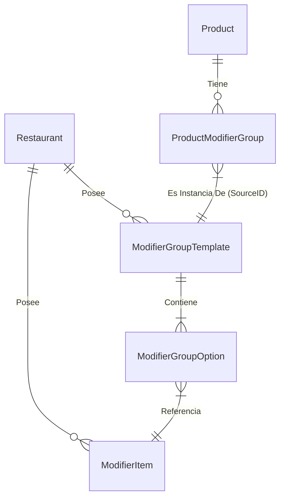

# 📑 Especificación Completa: Sistema de Gestión de Menús y Modificadores

Este documento consolida la visión funcional, el flujo de trabajo y la arquitectura de datos para el nuevo sistema de menús de YummyApp, diseñado para soportar estructuras complejas como Menús Ejecutivos, Combos y personalizaciones reutilizables.

---

## 1. 🎯 Visión y Propósito
El objetivo es transformar la gestión de menús de un modelo "estático y repetitivo" a un modelo "dinámico y reutilizable" (Biblioteca). Esto permite a los restaurantes escalar su oferta sin multiplicar su carga operativa.

### Problema Anterior
*   Para crear 5 combos que incluían "Sopa", se tenía que escribir "Sopa" 5 veces.
*   Si el precio de la sopa cambiaba, se tenía que editar en 5 lugares.
*   No existía una forma centralizada de gestionar "Reglas" (ej. "Solo lunes").

### Solución Implementada
*   **Biblioteca Centralizada:** Los componentes (Sopa) y Grupos (Entradas Lunes) se crean una vez.
*   **Vinculación:** Los productos referencia a estos grupos, no los copian.
*   **Gestión Global:** Un cambio en la biblioteca se refleja en todos los productos vinculados.

---

## 2. 👤 Historias de Usuario

### Gerente de Restaurante
> "Como gerente, quiero definir mis 'Guarniciones del Día' en un solo lugar y asignarlas a todos mis platos ejecutivos, para no perder tiempo configurando cada plato individualmente cada mañana."

### Cocinero / Personal
> "Como cocinero, quiero que las órdenes lleguen con los modificadores estandarizados (siempre 'Sopa de Pollo', no 'sopa pollo' o 'S. Pollo'), para evitar confusiones en la preparación."

### Cliente Final
> "Como cliente, quiero poder personalizar mi pedido fácilmente, viendo claramente qué opciones están disponibles y cuánto cuestan los extras, para tener una experiencia de compra transparente."

---

## 3. 🔄 Flujo de Trabajo Detallado

### Fase 1: Construcción de la Biblioteca (Configuración Única)
1.  **Crear Componentes (`ModifierItem`):**
    *   El usuario ingresa a "Bibliotecas".
    *   Registra items atómicos: *Arroz Chaufa*, *Papas Fritas*, *Inka Kola*.
    *   *Estos items no tienen precio aquí, son solo definiciones.*

2.  **Crear Grupos (`ModifierGroup`):**
    *   El usuario crea un contenedor: *Guarniciones de Almuerzo*.
    *   Define reglas: "Elige Mínimo 1, Máximo 1".
    *   Agrega componentes a este grupo y **aquí asigna precios**:
        *   *Papas Fritas* (+$0.00)
        *   *Arroz Chaufa* (+$1.50)

### Fase 2: Armado del Menú (Día a Día)
1.  **Crear/Editar Producto:**
    *   El usuario va a crear "Lomo Saltado Ejecutivo".
    *   Ingresa precio base ($12.00) y descripción.

2.  **Vincular Modificadores:**
    *   En la pestaña "Extras", selecciona **"Vincular Grupo"**.
    *   Elige *Guarniciones de Almuerzo* de la lista.
    *   El grupo se adhiere al producto.

### Fase 3: Venta (Frontend Cliente)
1.  **Selección:**
    *   El cliente elige "Lomo Saltado Ejecutivo".
    *   Ve las opciones del grupo vinculado.
    *   Selecciona *Arroz Chaufa* (El sistema suma +$1.50 al total).
2.  **Carrito:**
    *   El pedido guarda: `Producto: Lomo Saltado` + `Modificador: Arroz Chaufa (ID: 102)`.

---

## 4. 🗄️ Arquitectura de Datos

### Diagrama ER

### Diccionario de Datos

#### A. Entidad `ModifierItem` (Componente)
*Elemento base reutilizable.*
| Campo | Descripción |
|-------|-------------|
| `id` | Identificador único (UUID/Int). |
| `name` | Nombre del ítem (ej. "Huevo Frito"). |
| `restaurant_id` | Dueño del ítem. |

#### B. Entidad `ModifierGroupTemplate` (Grupo de Biblioteca)
*Plantilla de configuración de modificadores.*
| Campo | Descripción |
|-------|-------------|
| `id` | Identificador único. |
| `name` | Nombre del grupo (ej. "Adicionales Desayuno"). |
| `min_select` | Mínimo de opciones requeridas. |
| `max_select` | Máximo de opciones permitidas. |

#### C. Entidad `ModifierGroupOption` (Opción de Grupo)
*Relación entre Grupo e Item con precio.*
| Campo | Descripción |
|-------|-------------|
| `group_id` | Pertenece a qué grupo. |
| `item_id` | Qué item es. |
| `price_delta` | Precio extra AL ELEGIR esta opción en este grupo. |

#### D. Entidad `ProductModifierGroup` (Vínculo en Producto)
*Instancia concreta en un producto.*
| Campo | Descripción |
|-------|-------------|
| `id` | ID local del grupo en el producto. |
| `product_id` | Producto padre. |
| `source_group_id` | **CRÍTICO:** ID del `ModifierGroupTemplate` original. Permite la sincronización. |
| `overrides` | (JSON/Columna) Posibilidad de sobrescribir precios específicos para este producto si se requiere. |

---

## 5. 🛠️ Detalles Técnicos de Implementación

### Frontend (React/Typescript)
*   **Estado Global:** Utiliza `useState` en `RestaurantMenuPage` para mantener la "verdad" de la biblioteca (`modifierItems`, `modifierGroups`) y pasarla a los modales.
*   **Persistencia:** Al guardar, el frontend debe enviar 2 estructuras al backend:
    1.  El `Product` con sus `extras` array.
    2.  (Por separado o anidado) Las actualizaciones a la `Library` si el usuario editó la biblioteca.

### Backend (Sugerido)
*   **Endpoints Requeridos:**
    *   `GET /api/restaurant/{id}/library` -> Retorna items y grupos.
    *   `POST /api/restaurant/{id}/library/items` -> Crea item.
    *   `POST /api/restaurant/{id}/library/groups` -> Crea grupo.
    *   `POST /api/products` -> Crea producto (debe aceptar la estructura de `extras` vinculados).

### Validaciones Clave
1.  **Integridad Referencial:** No permitir eliminar un `ModifierItem` si es usado en algún `ModifierGroup`.
2.  **Reglas de Selección:** El frontend debe bloquear la adición al carrito si no se cumple `min_select`.
